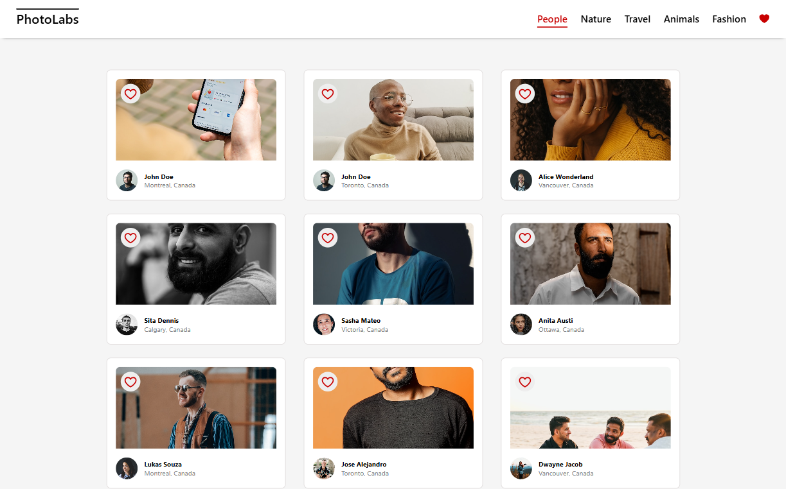
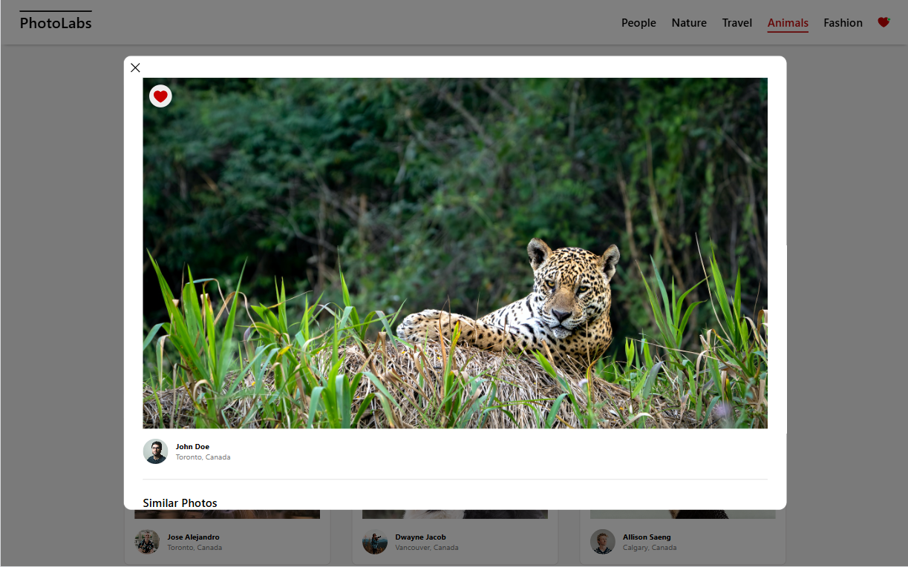

# PhotoLabs

PhotoLabs is a full-stack web application that allows users to browse, like, and view photos by category. The project is built using **React** for the frontend and **Express.js** with PostgreSQL for the backend.

## Features
- View photos from the homepage loaded from the API.
- Navigate through different photo categories (topics).
- Click on a photo to view a larger version and similar photos.
- Like photos from anywhere within the application.
- View a heart icon with a notification in the navigation when photos are liked.
- Dynamic navigation with different topics and a heart icon.

---

## Tech Stack

### **Frontend** (React)
- React 18
- React DOM
- React Scripts
- SASS

### **Backend** (Express.js)
- Express.js
- PostgreSQL
- CORS
- dotenv
- body-parser
- helmet
- WebSockets (socket.io, ws)
- Jest & Supertest for testing

---

## Getting Started

### **1. Clone the repository**

```sh
git clone https://github.com/Darshita-04/PhotoLabs.git
cd photolabs
```

### **2. Install dependencies**

#### **Frontend**
```sh
cd frontend
npm install
```
#### **Backend**
```sh
cd backend
npm install
```

### **3. Creating The DB**

Use the `psql -U labber` command to login to the PostgreSQL server with the username `labber` and the password `labber`. This command **MUST** be run in a vagrant terminal, we are using the PostgreSQL installation provided in the vagrant environment. M1/M2 and WSL2 users can execute this command in their terminal.

Create a database with the command `CREATE DATABASE photolabs_development;`.

### **4. Set up environment variables**

Copy the `.env.example` file to `.env.development` and fill in the necessary PostgreSQL configuration. The `node-postgres` library uses these environment variables by default.

```
PGHOST=localhost
PGUSER=labber
PGDATABASE=photolabs_development
PGPASSWORD=labber
PGPORT=5432
```

### **5. Seeding**

Run a the development server with `npm start` in the Host environment. We are only using vagrant for `psql` this week.

Both of these achieve the same result.

- Make a `GET` request to `/api/debug/reset` with `curl http://localhost:8001/api/debug/reset`.
- Use the browser to navigate to `http://localhost:8001/api/debug/reset`.

### **6. Start the backend server**

```sh
npm start
```
The backend will be running at `http://localhost:8001`

Running the server so it returns an error when saving/deleting for testing the client's error handling capabilities
```sh
npm run error
```

### **7. Start the frontend application**

Open a new terminal and run:
```sh
cd frontend
npm start
```
The frontend will be running at `http://localhost:3000`

---

## Screenshots

### Homepage


### Photo Modal


---

## API Endpoints
| Method | Endpoint | Description |
|--------|-------------|-------------|
| GET | `/api/photos` | Fetch all photos |
| GET | `/api/topics` | Fetch all topics |
| GET | `/api/topics/photos/:topicId` | Fetch photos by topic |

---

## Folder Structure
```
photolabs/
│── backend/
│   ├── src/
│   │   ├── index.js        # Entry point for the backend
│   │   ├── db/             # Database schema and queries
│   │   ├── routes/         # Express routes
│   ├── package.json
│
│── frontend/
│   ├── src/
│   │   ├── components/     # React components
│   │   ├── hooks/          # Custom hooks
│   │   ├── App.jsx         # Main App component
│   ├── package.json
│
│── README.md
```

---

## Future Improvements
- Implement authentication (user login & signup)
- Add pagination for large photo collections
- Optimize database queries
